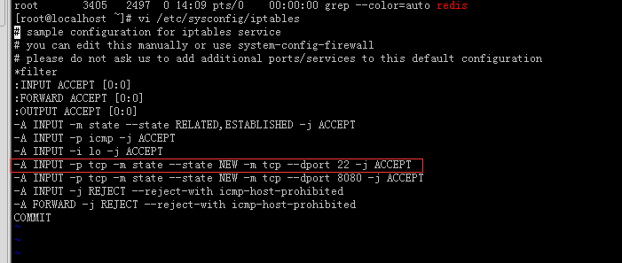
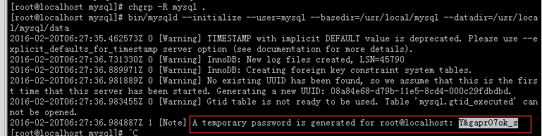
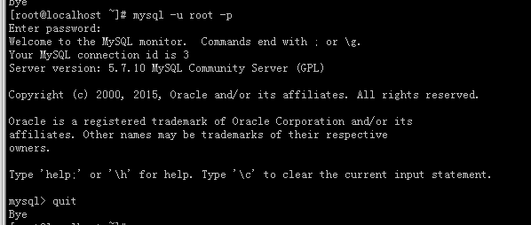
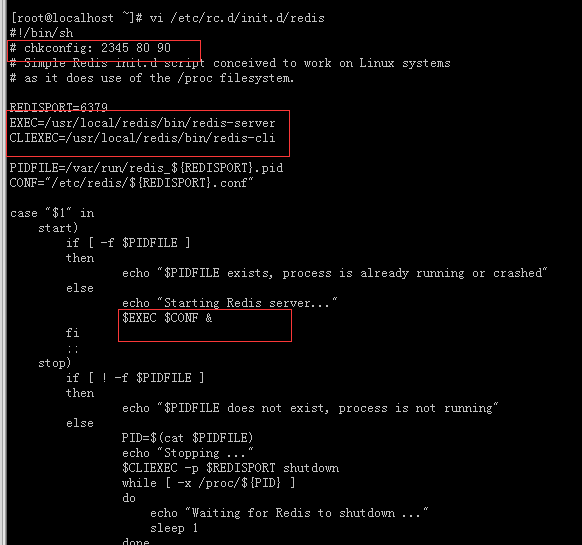

## 1. jdk配置

### 1.1 下载

[http://www.oracle.com/technetwork/java/javase/downloads/jdk7-downloads-1880260.html](http://www.oracle.com/technetwork/java/javase/downloads/jdk7-downloads-1880260.html)
<br>下载文件存放在 [ /usr/local/ ] ，下载rmp格式的文件

### 1.2 安装

首先检查系统是否安装jdk，使用` java –version `命令，如果有，则先卸载，卸载命令` rpm –qa|grep java `；否则安装自己所需要配置的jdk

路径切换到文件存放路径下，然后使用该` rpm -ivh jdk-7-linux-i586.rpm `命令解压安装，默认安装路径 ` /usr/java/jdk1.7.0-xx ` ，使用` mv /usr/java/jdk1.7.0-xx /usr/java/jdk7 `命令更改文件名

### 1.3 环境变量

配置环境变量，打开配置文件profile
`vi  /etc/profile `
在该profile文件中最下面添加：
```
JAVA_HOME=/usr/java/jdk1.7.0/      //自己的jdk路径
JRE_HOME=/usr/java/jdk1.7.0/jre
PATH=$PATH:$JAVA_HOME/bin:$JRE_HOME/bin
CLASSPATH=.:$JAVA_HOME/lib/jt.jar:$JAVA_HOME/lib/tools.jar:$JRE_HOME/lib
export JAVA_HOME JRE_HOME PATH CLASSPATH
```
添加完毕保存退出
此` source /etc/profile `命令使profile文件生效

### 1.4 测试

检查是否安装成功` java –version `

如果以上都ok，恭喜你进入升级了，进入下一个配置

[参考资料](http://blog.csdn.net/gxy3509394/article/details/8166288)

---

## 2. 防火墙配置

centos7 关闭firewall安装iptables并配置
[参考资料](http://linux.it.net.cn/CentOS/fast/2015/0110/11567.html)

---

## 3. tomcat7配置

### 3.1 下载

[tomcat7下载](http://apache.etoak.com/tomcat/tomcat-7/v7.0.28/bin/apache-tomcat-7.0.28.tar.gz)

下载文件存放在 ` /usr/local/ `

### 3.2 解压安装

切换到tomcat路径下，使用该` tar -zxvf apache-tomcat-7.0.28 ` 命令解压安装，可以使用命令` mv /usr/local/apache-tomcat-7.0.28 /usr/local/tomcat7 `修改文件名
赋予tomcat的执行权限 ` chmod +x /usr/local/tomcat7 `

### 3.3 环境配置

编辑profile文件
` vi /etc/profile `
在该profile文件中最下面添加：
```
TOMCAT_HOME=/usr/local/apache-tomcat-7.0. 28
CATALINA_HOME=/usr/local/apache-tomcat-7.0. 28
export TOMCAT_HOME CATALINA_HOME
```
添加完毕保存退出
此` source /etc/profile `命令使profile文件生效

### 3.4 测试

将tomcat默认端口8080加入防火墙，启动tomcat，浏览器进行测试，这一步偷点懒。
` vi /etc/sysconfig/iptables `



把红色内容复制一遍，只需修改端口号，保存退出，重启防火墙` service iptables restart `
[参考资料](http://blog.sina.com.cn/s/blog_866c5a5d0101cn1l.html)

## 4. mysql配置

下载
`mysql-5.7.10-linux-glibc2.5-x86_64.tar.gz（glibc版）`

PS：不要下载mysql-5.7.10.tar.gz这个版本，安装很麻烦，需要做很多前期准备

### 4.1 安装

` tar -zxvf mysql-5.7.10-linux-glibc2.5-x86_64.tar.gz `
` ln –s mysql-5.7.10-linux-glibc2.5-x86_64 mysql `

详细操作参考该[文档](http://wenku.baidu.com/link?url=NqkJUebUq6lfmFdKODMwMeGFq5D2NhU7L4VfKWu0BUi5j9UvoOVWzSrxi8iYLmpK6SOoAB5UgO8eXp6wqOjvVte0LvQCZTST7E-cOrufR6C)

**注意mysql安装过程中的临时密码**


### 4.2 配置

是否把端口加入防火墙取决于需求

**权限分配**
```
给ito分配权限
mysql> revoke all on *.* from ito@"%" identified by '123456';
先收回名为ito的用户的说有权限
mysql> grant usage on *.* to test@192.168.82.139 identified by '123456';
给名为ito,ip为192.168.82.13的用户登录查看权限, 登录密码为123456
mysql> grant select, insert, update, delete on *.* to ito@192.168.82.139 identified by '123456';给ip为192.168.82.139的ito用户授予增删改查权限，登录密码为123456
mysql> show grants for ito@192.168.82.139;
查看名为ito,ip为192.168.82.13的用户权限
mysql> flush privileges;
刷新权限

给名为test的用户分配查看的权限：
mysql> revoke all on *.* from test@"%" identified by '123456';
先收回名为test的用户的说有权限
mysql> grant usage on *.* to test@"%" identified by '123456';
给名为test的任意ip所有所有用户登录查看权限
mysql> grant select on *.* to test@% identified by '123456';
给名为test的任意ip所有所有用户分配查看权限
mysql> show grants for test@%;
查看名为test的任意ip所有所有用户的权限
mysql> flush privileges;
刷新权限

mysql> revoke all on *.* from root@"%" identified by '123456';
给名为root的用户设置权限前要先收回所有权限
mysql> grant all on *.* to ito@192.168.82.139 identified by '123456';
给名为root，ip为192.168.82.139的用户分配所有权限，登录密码为123456
mysql> grant all on *.* to ito@192.168.82.71 identified by '123456';
给名为root，ip为192.168.82.71的用户分配所有权限，登录密码为123456
mysql> show grants for root@%;
查看名为root的任意ip所有所有用户的权限
mysql> show grants for root@192.168.82.139;
查看名为root,ip为192.168.82.13的用户权限
mysql> show grants for root@192.168.82.71;
查看名为root,ip为192.168.82.13的用户权限

mysql> flush privileges;
刷新权限
```

### 4.4 测试



---

## 5 redis配置

### 5.1 下载

官网下载redis，版本任意，存放在` /usr/local/ `该路径下

### 5.2 安装

切换到redis存放位置

解压` tar –zxvf redis-3.0.6.tar.gz `

设置超链接` ln –s redis-3.0.6 /usr/local/redis `

切换路径` cd redis `

安装 ` make PREFIX=/usr/local/redis install `

### 5.3 配置

- 复制脚本到/etc/rc.d/init.d目录
	` cp /usr/local/redis/utils/redis_init_script /etc/rc.d/init.d/redis `

- 更改redis脚本
	` vi /etc/rc.d/init.d/redis `
	修改的内容(三处)：

```
'#'chkconfig: 2345 80 90

EXEC=/usr/local/redis/bin/redis-server
CLIEXEC=/usr/local/redis/bin/redis-cli

$EXEC $CONF &
```



- 将redis配置文件拷贝到*/etc/redis/${REDISPORT}.conf*
	` mkdir /etc/redis `
	` cp /usr/local/redis/redis.conf /etc/redis/6379.conf `

- 将Redis的命令所在目录添加到系统参数PATH中

	打开文件` vi /etc/profile `

	在最后行追加 ** export PATH="$PATH:/usr/local/redis/bin" **

	文件生效` . /etc/profile  `

- 注册redis服务
	` chkconfig --add redis `

- 启动redis服务
	` service redis start `

	Ctrl+c 退出，redis在后台开启

- 开启redis密码
	密码：在redis.conf里找'requirepass'后加密码，重启redis

- Redis重启数据恢复
	数据恢复：在redis.conf里找'appendonly'的no改为yes

- 初始化值
	设置两个值从10000开始
```
[ > set SEQ.KEY 10000 ]    //java使用的key从10000开始
[ > set SEQ.SN 10000 ]	   //java使用的sn从10000开始
```

### 5.4 测试

` redis-cli `

如果有密码，输入` -a `

[参考资料](http://www.cnblogs.com/_popc/p/3684835.html)

---

## 6. ~~nginx配置(无)~~


---

## 7. 文件配置

- 文件服务

http服务

查看http服务是否开启 ` chkconfig --list`   若没有开启，则`service httpd start`

修改文件**/etc/httpd/conf/httpd.conf**

```
	//在文件末尾加上
		ServerName *:8888
		NameVirtualHost 192.168.46.172:8888
		<VirtualHost 192.168.46.172:8888>
				DocumentRoot /var/www/ito
				ServerName station1.example.com
				ServerAlias server1.example.com
		</VirtualHost>
	//修改	ps: Listener的80-->8888
```
保存退出

建相应的根目录` mkdir /var/www/ito/ `

重启httpd,如果出现绑定端口失败，请阅读[文章](http://kinggoo.com/app-httpderrornotport.htm)

把文件服务端口加入防火墙

---

## 8. jmx配置

Jmx配置分验证和无验证两种方式，我们使用无验证方式的配置。

修改**Tomcat**目录下的`bin\catalina.sh`

在该文件中查找`set JAVA_OPTS=%JAVA_OPTS%`，下面有一行为：

**rem ----- Execute The Requested Command ---------------------------------------**

在这一行的下面加
```
set JAVA_OPTS=-Dcom.sun.management.jmxremote -Dcom.sun.management.jmxremote.port=9008 -Dcom.sun.management.jmxremote.authenticate=false -Dcom.sun.management.jmxremote.ssl=false 
//PS：9008为jmx端口号，一会儿要用到。
```

重启服务

在cmd中执行netstat -an，可查看到9008端口已经启用，说明Tomcat的Jmx配置成功

**端口记得加入防火墙**

使用windows下的jconsole远程连接

在cmd中敲入：jconsole（这个exe令在C:\Program Files\Java\jdk1.6.0_23\bin，即安装目录的bin下），即可启动jconsole的管理界面，在界面中输入如下内容：

** service:jmx:rmi:///jndi/rmi://192.168.46.172:9008/jmxrmi **

需要密码验证的配置参考该[文章](http://my.oschina.net/u/1164238/blog/135866)

不需要密码验证的配置参考[文章](http://blog.sina.com.cn/s/blog_5421dfd20100nz0z.html)

> 一沙一世界，一花一天堂。双手握无限，刹那是永恒。
